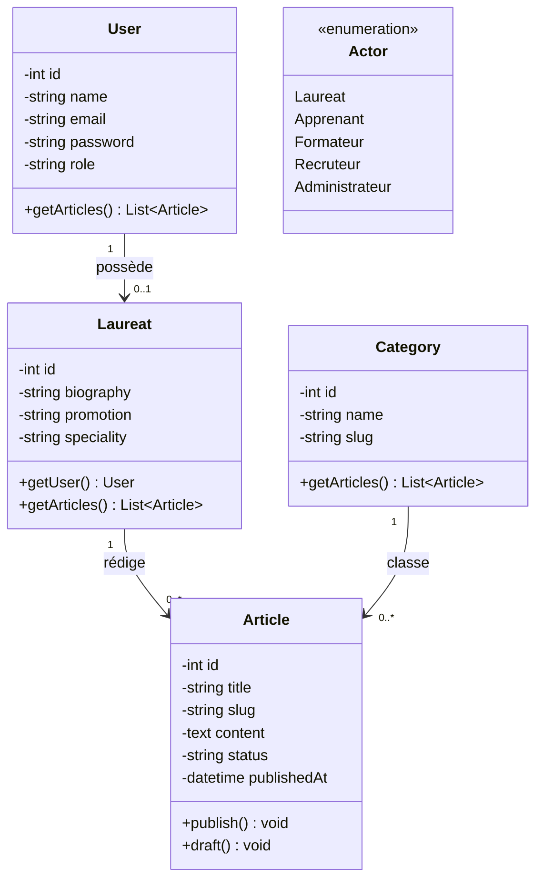

# Diagramme de classes

```mermaid
classDiagram
    direction TB

    class User {
        -int id
        -string name
        -string email
        -string password
        -string role
        +getArticles() List~Article~
    }

    class Laureat {
        -int id
        -string biography
        -string promotion
        -string speciality
        +getUser() User
        +getArticles() List~Article~
    }

    class Article {
        -int id
        -string title
        -string slug
        -text content
        -string status
        -datetime publishedAt
        +publish() void
        +draft() void
    }

    class Category {
        -int id
        -string name
        -string slug
        +getArticles() List~Article~
    }

    class Actor {
        <<enumeration>>
        Laureat
        Apprenant
        Formateur
        Recruteur
        Administrateur
    }

    User "1" --> "0..1" Laureat : possède
    Laureat "1" --> "0..*" Article : rédige
    Category "1" --> "0..*" Article : classe
```

